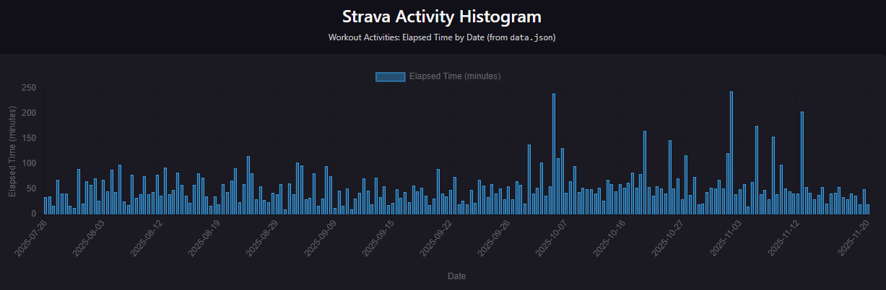

# Strava Activity Histogram (Postman + Chart.js)

This project visualizes my workout activity data from Strava using the Strava API, Postman, and Chart.js.
The goal was to explore workout duration trends over time by transforming raw API responses into an interactive histogram.
The visualization displays elapsed workout time (minutes) by date, highlighting patterns such as increased training duration in later months while maintaining consistent activity frequency.

## Live Visualization
https://k1rby-s.github.io/strava-heatmap-postman-visualization/heatmap.html

## Preview

## Tools & Technologies
- Strava API
- Postman (OAuth, API requests, data processing, visualization)
- Chart.js
- GitHub Pages

## Authentication & API Access
- OAuth authorization handled via Strava’s `/oauth/authorize` endpoint  
- Access and refresh tokens managed securely in Postman environments  
- API requests scoped to `activity:readall`  
- Sensitive credentials are **not included** in this repository

## Data Processing
All data processing is performed within Postman:
- Raw activity data retrieved from the Strava API
- Activities sorted chronologically by start date
- Elapsed time converted from seconds to minutes
- Processed data passed into a Chart.js visualization
